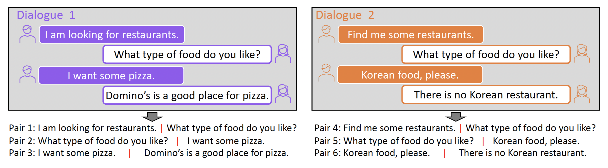

# DSE: Learning Dialogue Representations from Consecutive Utterances


This repository contains the code for our paper

[Learning Dialogue Representations from Consecutive Utterances" (NAACL 2022)](https://www.amazon.science/publications/learning-dialogue-representations-from-consecutive-utterances).


## Contents

- [1. Introduction](#1-introduction)
- [2. Pre-trained Models](#2-pre-trained-models)
- [3. Setup Environment](#3-setup-environment)
- [4. Quick Start](#4-quick-start)
- [5. Train DSE](#5-train-dse)
- [6. Evaluate DSE](#6-evaluate-dse)
- [7. Citation](#7-citation)


## 1. Introduction

DSE is a pre-trained conversational language model that can serve as a drop-in replacement of text encoder (e.g., BERT) for various dialogue systems. It learns dialogue representations by taking consecutive utterances within the same dialogues as positive pairs for contrastive learning. Please refer to our paper for more details.




## 2. Pre-trained Models

The pre-trained models will be available at HuggingFace ModulHub very soon.


## 3. Setup environment

    # create and activate virtual python environment
    conda create -n dse python=3.7
    conda activate dse
    
    # install required packages
    conda install pytorch torchvision torchaudio cudatoolkit=10.2 -y -c pytorch # change the version of cudatoolkit based on your cuda version
    python3 -m pip install -r requirements.txt
    


## 4. Quick Start

Our model is easy to use with the [transformers](https://github.com/huggingface/transformers) package.


```python
import torch
from transformers import AutoModel, AutoTokenizer
from torch.nn import CosineSimilarity

# Load the model and tokenizer
model = AutoModel.from_pretrained("aws-ai/dse-bert-base")
tokenizer = AutoTokenizer.from_pretrained("aws-ai/dse-bert-base")

# Define the sentences of interests
texts = ["When will I get my card?",
         "Is there a way to know when my card will arrive?"]

# Define a function that calculate text embedding for a list of texts
def get_average_embedding(texts):
    inputs = tokenizer(texts, padding=True, truncation=True, return_tensors="pt")

    # Calculate the sentence embeddings by averaging the embeddings of non-padding words
    with torch.no_grad():
        embeddings = model(input_ids=inputs["input_ids"], attention_mask=inputs["attention_mask"])
        attention_mask = inputs["attention_mask"].unsqueeze(-1)
        embeddings = torch.sum(embeddings[0]*attention_mask, dim=1) / torch.sum(attention_mask, dim=1)
        return embeddings

cosine_sim = CosineSimilarity(dim=0)
embeddings = get_average_embedding(texts)

print("Similarity of the two sentences is: ", cosine_sim(embeddings[0], embeddings[1]).item())
```


## Model List

We released the following five models. You can import these models by using [HuggingFace's Transformers](https://github.com/huggingface/transformers). 

| Model                                                                                                            | 
|:-----------------------------------------------------------------------------------------------------------------|
| [aws-ai/dse-distilbert-base](https://huggingface.co/aws-ai/dse-distilbert-base)                                  |   
| [aws-ai/dse-bert-base](https://huggingface.co/aws-ai/dse-bert-base)                                              |
| [aws-ai/dse-bert-large](https://huggingface.co/aws-ai/dse-bert-large)                                            |
| [aws-ai/dse-roberta-base](https://huggingface.co/aws-ai/dse-roberta-base)                                        |  
| [aws-ai/dse-roberta-large](https://huggingface.co/aws-ai/dse-roberta-large)                                            |   


## 5. Train DSE

Our code base expects two type of positive pairs for pre-training: existing positive pairs (e.g., consecutive utterances) or "Dropout or the same sentence". To use existing positive pairs for pre_training, simply use a `tsv` or `csv` file where each row contains one positive pair. To use Dropout, simply use a `txt` file where each row contains a single sentence/paragraph.


For example, given a `train.csv` file, DSE can be trained as:

```
export DATA_DIR=/PATH/To/Training/Data/Folder
export FILE_NAME="train.csv"
export OUTPUT_DIR=/PATH/To/Output/Folder
export MODEL_TYPE=bertbase # choose from [bertbase, bertlarge, robertabase, robertalarge, distilbertbase]
cd pretrain

python main.py \
    --resdir ${OUTPUT_DIR} \
    --datapath ${DATA_DIR} \
    --dataname tod_single_pos_3.tsv \
    --mode contrastive \
    --bert ${MODEL_TYPE} \
    --contrast_type HardNeg \
    --lr 3e-06 \
    --lr_scale 100 \
    --batch_size 1024 \
    --max_length 32 \
    --temperature 0.05 \
    --epochs 15 \
    --max_iter 10000000 \
    --logging_step 400 \
    --feat_dim 128 \
    --num_turn 1 \
    --seed 1 \
    --save_model_every_epoch 

```


### 5.1 Reproduce Our Training

To reproduce our experiments, please generate training data as follows. We sincerely appreciate [TOD-BERT authors](https://github.com/jasonwu0731/ToD-BERT) for preparing these great scripts.

```
export WORK_PLACE="/home"
export OUTPUT_DIR="/home/data/dse_training.tsv"

# 1. Clone the repos

cd $WORK_PLACE
git clone https://github.com/jasonwu0731/ToD-BERT
git clone https://github.com/amazon-research/dse

# 2. Downloads the raw datasets from https://drive.google.com/file/d/1EnGX0UF4KW6rVBKMF3fL-9Q2ZyFKNOIy/view?usp=sharing
#    and put the "TODBERT_dialog_datasets.zip" file at current directory

# 3. Unzip the downloaded file 

unzip TODBERT_dialog_datasets.zip -d $WORK_SPACE

# 4. Modify "ToD-BERT/my_tod_pretraining.py" to acquire the data processed by TOD-BERT's codebase
### 4.1 Change line 745 to default='/PATH/TO/dialog_datasets' (e.g., '/home/dialog_datasets')
### 4.2 Add the following line after line 951

        with open("pre_train.pkl", "wb") as f:
            pickle.dump(datasets, f) 

        raise ValueError("Done")

### 4.3 Run the following script, once it stops, a file named "pre_train.pkl" should appear in this folder

cd $WORK_PLACE/ToD-BERT
./run_tod_lm_pretraining.sh 0 bert bert-base-uncased save/pretrain/ToD-BERT-MLM --only_last_turn


# 5. Run our script to generate positive pairs from TOD-BERT's training data
cd $WORK_PLACE/dse/data
python process_pretrain.py --data_dir $WORK_PLACE/ToD-BERT/pre_train.pkl --output_dir $OUTPUT_DIR


# A tsv file should appear at OUTPUT_DIR, which can be directly used for model pre-training

```


## 6. Evaluate DSE

We provide codes for 5 downstream applications: 

1. Intent Classification: we formulate it as a single-sentence multi-class classification problem and evaluate it with accuracy.

2. Out-of-scope Detection: we formulate it as a single-sentence multi-class classification problem and evaluate it with accuracy, in-domain accuracy, out-of-scope accuracy, and out-of-scope recall

3. Sentence-Level Response Selection: we formulate it as a ranking problem. We respectively calculate the embeddings for response and query We always set the batch size as 100 during evaluation and calculate the recall@1/3/5/10. Perform on AmazonQA dataset.

4. Dialogue-Level Response Selection: Similar as above. But input to this task is dialogue history (concatenation of multiple dialogue sentences).

5. Dialogue Action Prediction: we formulate it as a multi-sentence multi-label classification problem. We use the concatenation of dialogue history as input.

   

The evaluations are performed in two ways:

1. Fine-tune: add task-specific layer(s) to the pre-trained model and optimize the entire model by training the model on labeled data. Support task 1,3,4,5.

2. Similarity-based methods: do not perform any model training. Make predictions singly based on the text embedding given by the pre-training model. When performing few-shot classification, we use [prototypical network](https://arxiv.org/pdf/1703.05175.pdf). Support task 1,2,3,4

   

### 6.1 Data Generation

To perform evaluations in our paper, please follow the instruction to generate the corresponding evaluation data.


#### 6.1.1 Intent Classification and Out-Of-Scope Detection

We use 4 public datasets:

 	1. Clinc 150
 	2. Banking 77
 	3. SNIPS
 	4. HWU64


```
export OUTPUT_DIR="/home/data/dse_evaluate"

# 1. Download raw data for snips and hwu64 (we direct acquire clinc150 and banking 77 from a package named "datasets")

wget https://raw.githubusercontent.com/clinc/nlu-datasets/master/nlu_datasets/intent_classification/snips_train.json
wget https://raw.githubusercontent.com/clinc/nlu-datasets/master/nlu_datasets/intent_classification/snips_test.json
wget https://raw.githubusercontent.com/xliuhw/NLU-Evaluation-Data/master/AnnotatedData/NLU-Data-Home-Domain-Annotated-All.csv
 

# 2. Run our scripts to generate data from the raw data

python process_evaluate.py --output_dir $OUTPUT_DIR --task clinc150
python process_evaluate.py --output_dir $OUTPUT_DIR --task bank77
python process_evaluate.py --output_dir $OUTPUT_DIR --task snips
python process_evaluate.py --output_dir $OUTPUT_DIR --task hwu64

```


#### 6.1.2 Response Selection


We use 2 public datasets:

 	1. AmazonQA
 	2. Ubuntu-DSTC7


We use [ParlAI](https://parl.ai/) to get the raw data, and provide scripts to generate data for our evaluation. 

```
export WORK_SPACE="/home"
export OUTPUT_DIR="/home/data/dse_evaluate"


# 1. Install ParlAi Package

cd $WORK_SPACE
git clone https://github.com/facebookresearch/ParlAI.git 
cd ParlAI; python setup.py develop


# 2. Use ParlAi to generate raw data

cd $WORK_SPACE/dse/data
parlai convert_to_parlai --task amazon_qa --datatype train --outfile amazonqa.txt
parlai convert_to_parlai --task dstc7 --datatype test --outfile ubuntu_test.txt
parlai convert_to_parlai --task dstc7 --datatype valid --outfile ubuntu_valid.txt


# 3. Use our scripts to generate evaluation data

python process_evaluate.py --output_dir $OUTPUT_DIR --task amazonqa
python process_evaluate.py --output_dir $OUTPUT_DIR --task ubuntu

```


For `AmazonQA`, we observe large performance fluctuation on the absolute evaluation metric with different random seed and different ordering of the QA pairs, yet the improvement of DSE over the baselines is consistent. For `Ubuntu-DSTC7`, since there is little randomness, we observe consistent performance as reported in the paper.


### 6.2 Similarity-based Evaluation

```
export DATA_DIR=/Path/To/Evaluation/Data
export MODEL_DIR=/Path/To/Pre-trained/Model
export OUTPUT_DIR=/Path/To/Output/Folder
cd evaluate
```

This part provides codes for using similarity-based methods to perform evaluation for any model that the Huggingface-transformers provides.

#### 6.2.1 Intent Classification

    python run_similarity.py \
        --model_dir ${MODEL_DIR} \
        --data_root_dir ${DATA_DIR} \
        --output_dir ${OUTPUT_DIR} \
        --TASK intent \
        --num_runs 10 \
        --max_seq_length 64

#### 6.2.2 Out-of-scope Detection

    python run_similarity.py \
        --model_dir ${MODEL_DIR} \
        --data_root_dir ${DATA_DIR} \
        --output_dir ${OUTPUT_DIR} \
        --TASK oos \
        --num_runs 10 \
        --max_seq_length 64

#### 6.2.3 Response Selection on AmazonQA

    python run_similarity.py \
        --model_dir ${MODEL_DIR} \
        --data_root_dir ${DATA_DIR} \
        --output_dir ${OUTPUT_DIR} \
        --TASK rs_amazon \
        --max_seq_length 128

#### 6.2.4 Response Selection on Ubuntu-DSTC7

    python run_similarity.py \
        --model_dir ${MODEL_DIR} \
        --data_root_dir ${DATA_DIR} \
        --output_dir ${OUTPUT_DIR} \
        --TASK rs_ubuntu \
        --max_seq_length 128


### 6.3 Fine-tune-based Evaluation

This part provides code for fine-tuning BERT model. We assume 2 GPUs for finetuning. If more of less number of GPUs are used, please adjust the `per_gpu_batch_size` accordingly.

```
export DATA_DIR=/Path/To/Evaluation/Data
export MODEL_DIR=/Path/To/Pre-trained/Model
export OUTPUT_DIR=/Path/To/Output/Folder
cd evaluate
```


#### 6.3.1 Intent Classification 

    for dataset in bank77 clinc150 hwu64 snips
    do  
        for data_ratio in 1 5
        do
            python run_finetune.py \
            --data_dir ${DATA_DIR}/intent/${dataset} \
            --model_type ${MODEL_DIR} \
            --TASK seq \
            --output_dir ${OUTPUT_DIR}/intent_${dataset}_${data_ratio} \
            --bert_lr 3e-5 \
            --epoch 50 \
            --max_seq_length 64 \
            --per_gpu_batch_size 8 \
            --gradient_accumulation_steps 1 \
            --data_ratio data_ratio \
            --num_runs 10 \
            --patience 5 \
            --classification_pooling average \
            --early_stop_type metric
        done
    done

#### 6.3.2 Response Selection 

    for data_ratio in 500 1000  
    do
        python run_finetune.py \
            --data_dir ${DATA_DIR}/rs/amazonqa \
            --model_type ${MODEL_DIR} \
            --TASK rs \
            --output_dir ${OUTPUT_DIR}/rs_amazonqa_${data_ratio} \
            --bert_lr 3e-5 \
            --epoch 50 \
            --max_seq_length 128 \
            --per_gpu_batch_size 50 \
            --gradient_accumulation_steps 1 \
            --data_ratio ${data_ratio} \
            --num_runs 5 \
            --patience 3 \
            --eval_steps 50 
    done

#### 6.3.3 Dialogue Action Prediction

    for dataset in dstc2 sim_joint
    do
        for data_ratio in 10 20
        do
            python run_finetune.py \
                --data_dir ${DATA_DIR}/da/${dataset} \
                --model_type ${MODEL_DIR} \
                --TASK da \
                --output_dir ${OUTPUT_DIR}/da_concat_${dataset}_${data_ratio} \
                --bert_lr 5e-5 \
                --epoch 100 \
                --max_seq_length 32 \
                --per_gpu_batch_size 16 \
                --gradient_accumulation_steps 1 \
                --data_ratio ${data_ratio} \
                --num_runs 5 \
                --patience 3 \
                --eval_steps 30 \
                --num_turn 1 \
                --concatenate \
                --save_model \
                --early_stop_type metric
        done
    done


## 7. Citation

If you have any question regarding our paper or codes, please feel free to start an issue or email Zhihan Zhou or Dejiao Zhang (zhihanzhou2020@u.northwestern.edu, dejiaoz@amazon.com).


If you use DSE in your work, please cite our paper:

```
@inproceedings{zhou-etal-2022-learning,
    title = "Learning Dialogue Representations from Consecutive Utterances",
    author = "Zhou, Zhihan  and
      Zhang, Dejiao  and
      Xiao, Wei  and
      Dingwall, Nicholas  and
      Ma, Xiaofei  and
      Arnold, Andrew  and
      Xiang, Bing",
    booktitle = "Proceedings of the 2022 Conference of the North American Chapter of the Association for Computational Linguistics: Human Language Technologies",
    month = jul,
    year = "2022",
    address = "Seattle, United States",
    publisher = "Association for Computational Linguistics",
    url = "https://aclanthology.org/2022.naacl-main.55",
    pages = "754--768",
    abstract = "Learning high-quality dialogue representations is essential for solving a variety of dialogue-oriented tasks, especially considering that dialogue systems often suffer from data scarcity. In this paper, we introduce Dialogue Sentence Embedding (DSE), a self-supervised contrastive learning method that learns effective dialogue representations suitable for a wide range of dialogue tasks. DSE learns from dialogues by taking consecutive utterances of the same dialogue as positive pairs for contrastive learning. Despite its simplicity, DSE achieves significantly better representation capability than other dialogue representation and universal sentence representation models. We evaluate DSE on five downstream dialogue tasks that examine dialogue representation at different semantic granularities. Experiments in few-shot and zero-shot settings show that DSE outperforms baselines by a large margin, for example, it achieves 13{\%} average performance improvement over the strongest unsupervised baseline in 1-shot intent classification on 6 datasets. We also provide analyses on the benefits and limitations of our model.",
}
```


